# AgroPrice AI — Agentic Agricultural Intelligence System

<p align="center">
  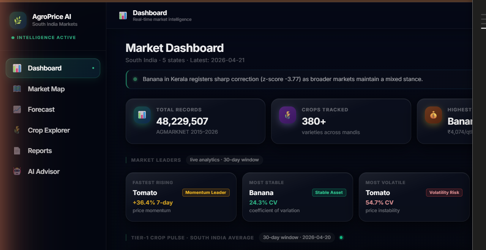
</p>

<p align="center">
  <strong>AI-powered crop price forecasting, market intelligence, and conversational advisory for South Indian agricultural markets</strong><br/>
  <em>MCA Elective Project — Generative AI | RVCE 2025–26</em>
</p>

<p align="center">
  
  
  
  
  
  
</p>

---

## Table of Contents

1. [Project Overview](#1-project-overview)
2. [Key Features](#2-key-features)
3. [System Architecture](#3-system-architecture)
4. [Technology Stack](#4-technology-stack)
5. [Screenshots](#5-screenshots)
6. [Project Presentation](#6-project-presentation)
7. [Dataset](#7-dataset)
8. [Folder Structure](#8-folder-structure)
9. [Setup & Installation](#9-setup--installation)
10. [API Reference](#10-api-reference)
11. [AI Advisor Pipeline](#11-ai-advisor-pipeline)
12. [Development Phases](#12-development-phases)
13. [Environment Variables](#13-environment-variables)
14. [Running Tests](#14-running-tests)

---

## 1. Project Overview

**AgroPrice AI** is an end-to-end Agentic Agricultural Intelligence System built for South Indian crop markets. It addresses a real-world problem: farmers and traders lack timely, accurate, and actionable price intelligence at the mandi (wholesale market) level.

The platform combines:
- **Deterministic ML forecasting** (Prophet + XGBoost) for reliable price predictions
- **Grounded Gemini 2.5 Flash AI** for conversational advisory that reasons *about* real data — never inventing prices or forecasts
- **Multi-agent decision intelligence** with 7 specialist agents, a probability engine, and cross-market relationship graphs
- **Autonomous market monitoring** with regime detection, escalation alerts, and executive briefings
- **Voice-enabled interface** with real-time streaming responses

### Who it's for

| User | Use case |
|------|----------|
| **Farmer** | "Should I sell my tomatoes now or wait 2 weeks?" |
| **Trader** | "Which crop has the highest momentum in Tamil Nadu?" |
| **Wholesaler** | "Best procurement timing for Onion this season?" |
| **Analyst** | "Full statistical brief on Chilli volatility vs Karnataka baseline" |

### Data coverage

- **27 crops** — Tomato, Onion, Rice, Wheat, Ragi, Banana, Coconut, Chilli, Turmeric, Cardamom, and more
- **5 states** — Tamil Nadu, Karnataka, Andhra Pradesh, Kerala, Telangana
- **12 years** — January 2015 – December 2026 (AGMARKNET dataset)

---

## 2. Key Features

### Price Intelligence
- Real-time mandi price lookup via DuckDB (sub-100ms queries on 10M+ rows)
- 7-day / 30-day / 90-day price forecasts with confidence scores
- Volatility scoring (Coefficient of Variation), momentum signals, anomaly detection
- Seasonality profiles per crop (peak / lean / trough phases)

### AI Advisor (Gemini 2.5 Flash)
- **Grounded responses** — Gemini narrates about real data, never generates prices from training
- **Multi-turn memory** — session context maintained across questions (crop/state inheritance)
- **Intent detection** — routes to the correct analytical pipeline (price, forecast, volatility, seasonal, historical, strategy)
- **4 analyst personas** — Farmer / Trader / Wholesaler / Analyst — each changes Gemini's framing
- **Voice input/output** — STT via Web Speech API, TTS with markdown stripping and Indian English voice
- **Real-time streaming** — SSE token-by-token streaming with `AbortController`
- **Historical queries** — "What was tomato price in June 2019?" retrieves real AGMARKNET data

### Multi-Agent Intelligence
- **7-Agent Specialist Council** — TrendAnalyst, RiskAnalyst, SeasonalAnalyst, SupplyDemandAnalyst, VolatilityAnalyst, OpportunityAnalyst, ForecastReliabilityAnalyst
- **Consensus Engine** — weighted aggregation, contradiction detection, confidence collapse detection
- **Probability Engine** — heuristic upside/downside/sideways probabilities + shock/reversal risk
- **Strategy Engine** — mode-specific action (SELL_NOW / SELL_SOON / HOLD / WAIT / WATCH) with entry/exit guidance
- **Cross-Market Relationship Graph** — 25+ crops, 7 relationship types (substitute, complement, seasonal, regional, storage, premium, spice)
- **Decision Trace Engine** — 6-stage pipeline trace with strongest/weakest evidence and impact narratives

### Autonomous Monitoring
- **Regime Detector** — 7 market regimes: BULLISH_EXPANSION, STABLE, PANIC_VOLATILITY, SEASONAL_CORRECTION, RECOVERY_PHASE, SEASONAL_PEAK_RUN, TRANSITIONAL
- **Temporal Intelligence** — detects accelerating / decelerating / reversing / stable momentum
- **Signal Fusion** — combines regime, escalation, priority, and temporal signals into a single flat dict
- **Market Monitor** — scans all Tier-1 crops across 5 states; priority-ranked with escalation alerts
- **Executive Briefing Engine** — Bloomberg-style briefing cards, zero LLM involvement
- **Command Mode** — full-screen dark terminal overlay: regime distribution, escalation list, priority matrix

### Dashboard & Visualization
- Executive command center with 8 configurable zones
- KPI cards with trend arrows, status rings, density control
- Bezier-smoothed sparklines, volatility meter, confidence gauge (SVG, no external chart lib)
- AI Signal Framework — 22 verdict types with centralized styling
- Opportunity matrix — 7-dimension scoring (opportunity × 0.35 + stability × 0.20 + confidence × 0.20 + timing × 0.15 + seasonal × 0.10)
- Cinematic dark theme (navy-black `#050816` with blue/purple/emerald ambient glows)

### Reports
- PDF export (ReportLab) with price history, forecast charts, and AI narrative
- Excel export (openpyxl) with multi-sheet crop data and analytics

---

## 3. System Architecture

### Critical Boundary: Deterministic vs LLM

```
┌──────────────────────────────────────────────────────────────┐
│  DETERMINISTIC ENGINE  (source of truth — never LLM)        │
│  • DuckDB price queries        • Volatility / CV scoring     │
│  • Prophet / XGBoost forecasts • Anomaly detection           │
│  • Confidence scores           • Seasonality profiles        │
│  • All numeric outputs                                       │
└───────────────────────────┬──────────────────────────────────┘
                            │ PromptContext (structured facts)
                            ▼
┌──────────────────────────────────────────────────────────────┐
│  LLM LAYER  (Gemini 2.5 Flash — narrates ABOUT real data)   │
│  • Natural language advisory   • Strategy explanation        │
│  • Forecast narration          • Anomaly explanation         │
│  • Conversational memory       • Seasonal interpretation     │
└──────────────────────────────────────────────────────────────┘
```

**The LLM never invents prices, forecasts, or confidence scores.** Every Gemini call is grounded — the deterministic engine runs first and passes its results via `PromptContext`.

### Request flow — AI Advisor

```
Frontend → POST /api/advisor/ask
    ↓
Guardrails (domain enforcement — blocks off-topic in ~4ms, no LLM call)
    ↓
Session Memory (crop/state inheritance, topic chain, 3-turn history)
    ↓
Intent Classification (rule-based, no LLM)
    ↓
Entity Extraction (crop/state from question text if selectors empty)
    ↓
Context Builder (DuckDB + analytics → volatility, momentum, anomaly, forecast)
    ↓
Historical Query Parser → AGMARKNET retrieval (if historical intent)
    ↓
4-Agent Pipeline (TrendAgent, RiskAgent, SeasonalAgent, RecommendationAgent)
    ↓
Confidence Engine + Correlation Engine + Persona Injection
    ↓
PromptBuilder (assembles full grounded prompt)
    ↓
Gemini 2.5 Flash (thinking_budget=0, max_output_tokens=2048, temp=0.2)
    ↓
AdvisorResponse {answer, intent, sources, agent_insights, grounded, latency_ms, session_id}
```

### Multi-Agent Decision Intelligence flow

```
GET /api/decision/council/{crop}/{state}
    ↓
_run_full_decision_pipeline() [asyncio.to_thread]
    ├── build_insight_context() → DuckDB + analytics
    ├── 7 AgentVotes (TrendAnalyst 22%, RiskAnalyst 18%, SeasonalAnalyst 15%,
    │   SupplyDemandAnalyst 15%, VolatilityAnalyst 12%,
    │   OpportunityAnalyst 10%, ForecastReliabilityAnalyst 8%)
    ├── ConsensusEngine → dominant_view, contradiction_detected, confidence_collapse
    ├── ProbabilityEngine → upside/downside/sideways + shock + reversal probabilities
    ├── StrategyEngine → mode-specific action, rationale, entry/exit, watch triggers
    ├── CrossMarketEngine → relationship graph, coupling_score, contagion_risk
    ├── ExecutiveSynthesisEngine → Bloomberg posture (CRISIS/OPPORTUNISTIC/DEFENSIVE/
    │   CAUTIOUS/NEUTRAL), institutional commentary
    └── DecisionTraceEngine → 6-stage pipeline trace, evidence quality, impact narratives
```

---

## 4. Technology Stack

| Layer | Technology | Purpose |
|-------|-----------|---------|
| **Frontend** | React 18, Vite 5, TailwindCSS 3 | SPA with HMR |
| **State** | Zustand | Lightweight global state |
| **Charts** | Recharts + custom SVG | Price charts, sparklines, gauges |
| **Routing** | React Router v6 | Client-side navigation |
| **Backend** | FastAPI 0.111, Uvicorn | REST API + SSE streaming |
| **Config** | Pydantic-settings v2 | Type-safe `.env` management |
| **Data Engine** | DuckDB 0.10, PyArrow, Pandas | Columnar analytics on Parquet |
| **ML Forecasting** | Prophet, XGBoost, scikit-learn | Time-series forecasting |
| **AI / LLM** | Google Gemini 2.5 Flash (`google-genai 2.8.0`) | Grounded conversational AI |
| **Voice** | Web Speech API (STT), speechSynthesis (TTS) | Voice input/output in browser |
| **Reports** | openpyxl, ReportLab | Excel and PDF generation |
| **Streaming** | FastAPI StreamingResponse (SSE) + native fetch | Real-time token streaming |

---

## 5. Screenshots

### Dashboard
<p align="center">
  
</p>

### Crop Explorer
<p align="center">
  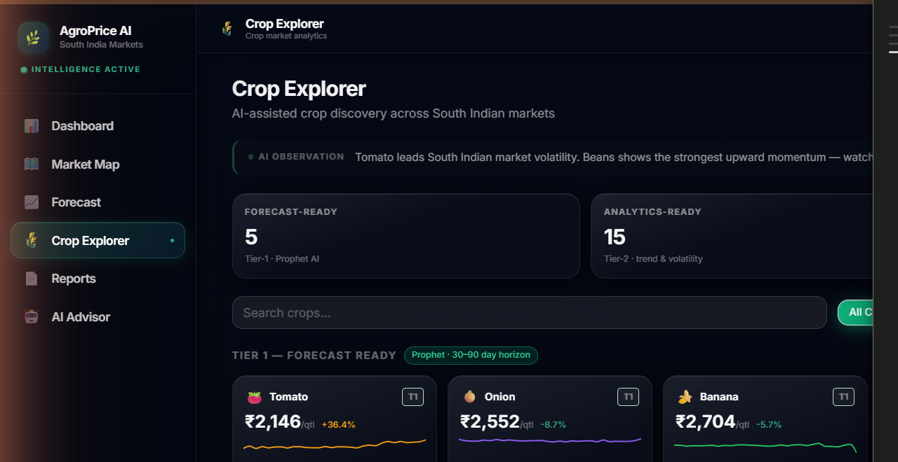
</p>

### Forecast Page with AI Signals
<p align="center">
  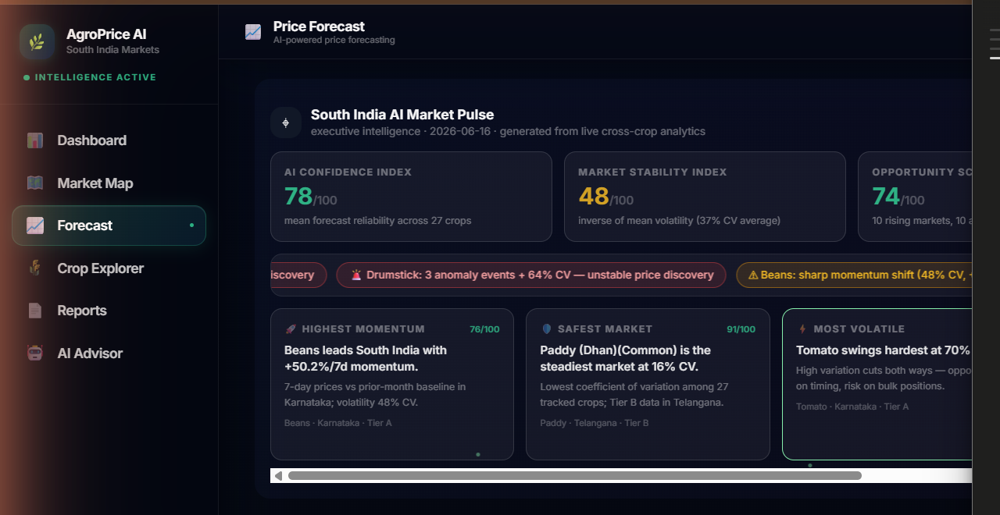
  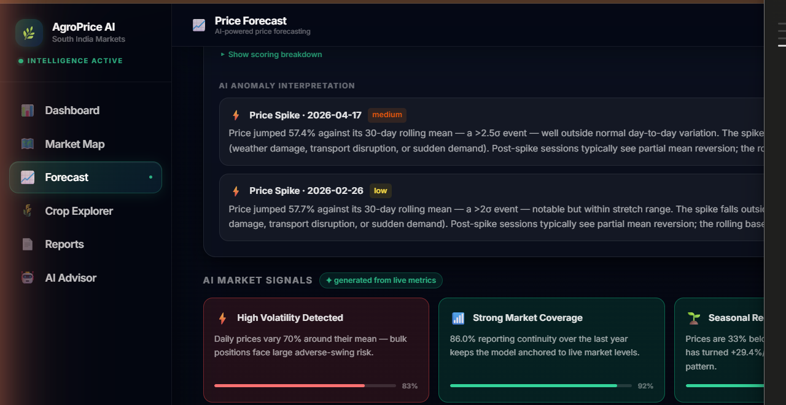
</p>

<p align="center">
  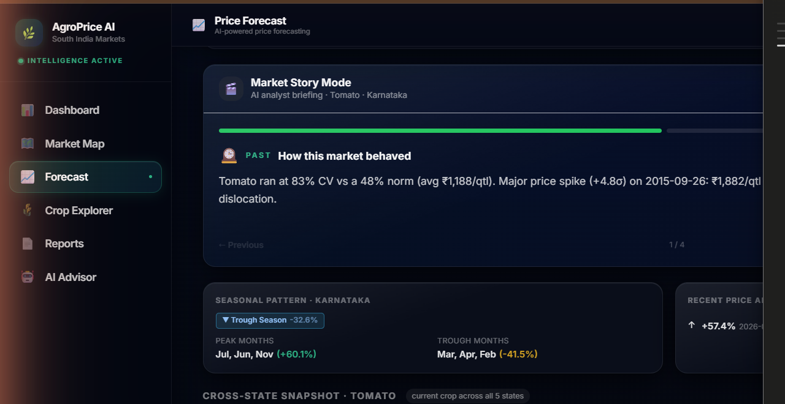
  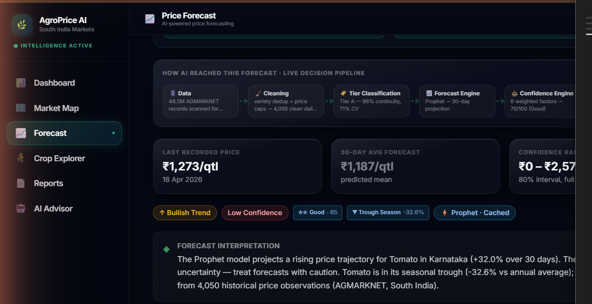
</p>

### AI Advisor — Command Center
<p align="center">
  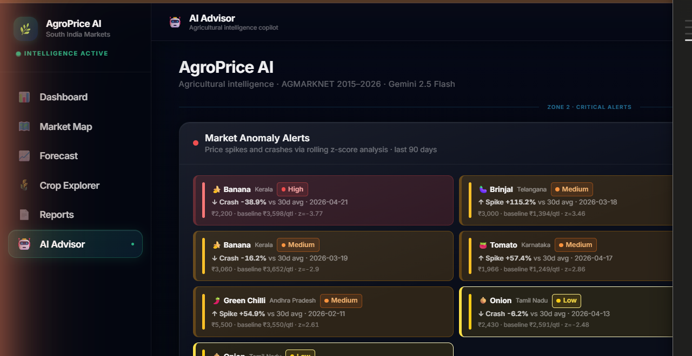
</p>

<p align="center">
  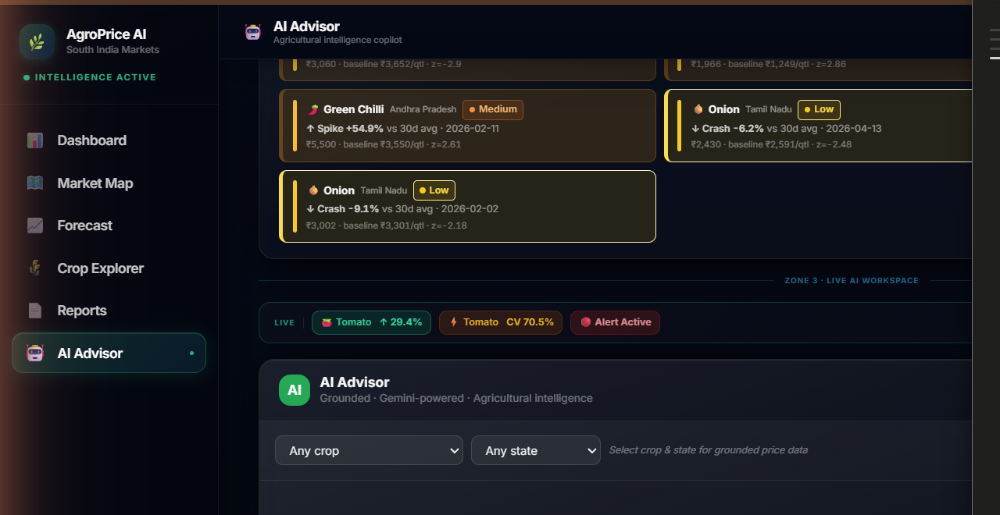
  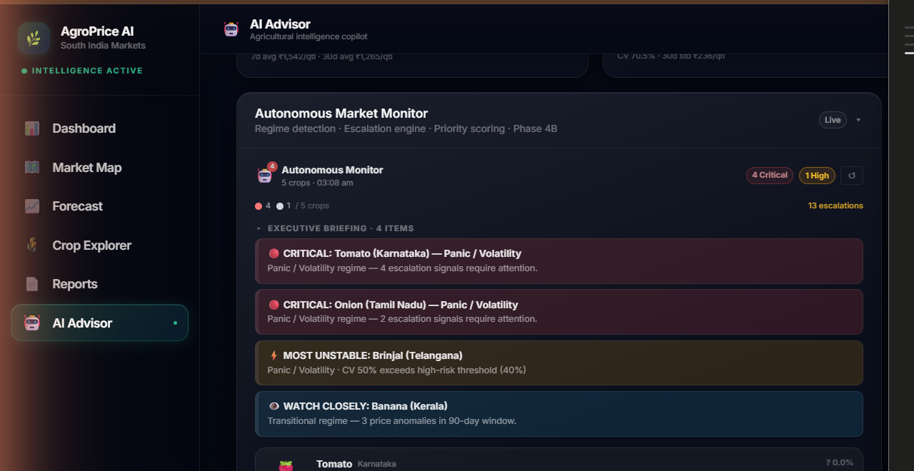
</p>

### Map Intelligence
<p align="center">
  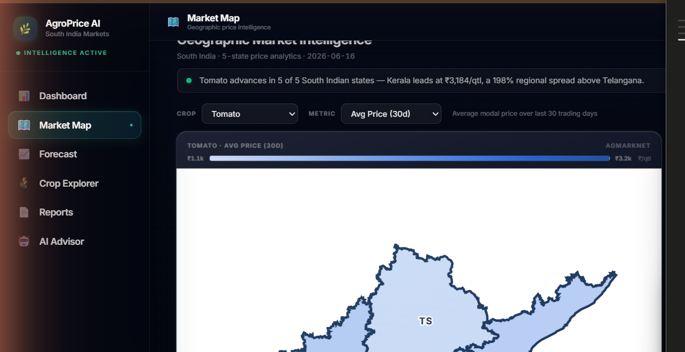
</p>

### Reports
<p align="center">
  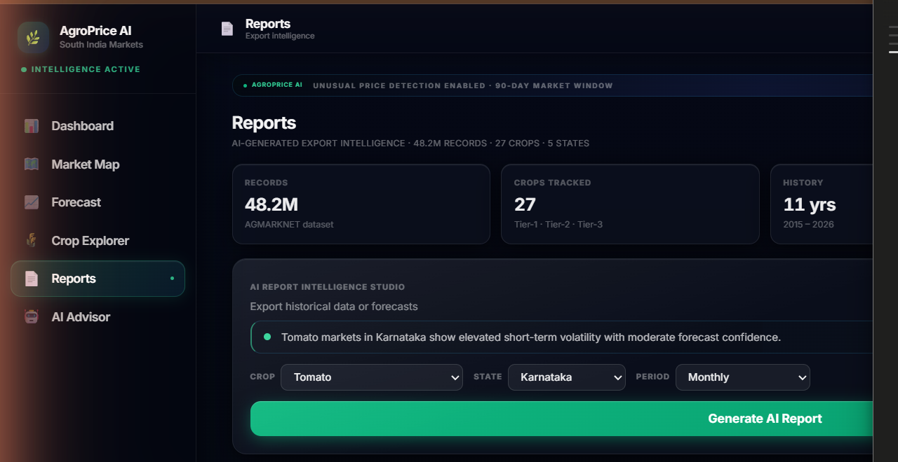
</p>

---

## 6. Project Presentation

The full project presentation is in the [`presentation/`](presentation/) folder:

| File | Description |
|------|-------------|
| [`AgroPrice_AI_FINAL.pptx`](presentation/AgroPrice_AI_FINAL.pptx) | **Complete 39-slide deck** — architecture, system design, all phases, results |
| [`AgroPrice_AI_GenAI_Theory.pptx`](presentation/AgroPrice_AI_GenAI_Theory.pptx) | GenAI theory slides — LLMs, grounding, guardrails, Gemini internals |
| [`AgroPrice_AI_Slides_1_10.pptx`](presentation/AgroPrice_AI_Slides_1_10.pptx) | Slides 1–10: Problem statement, dataset, data pipeline |
| [`AgroPrice_AI_Slides_11_19.pptx`](presentation/AgroPrice_AI_Slides_11_19.pptx) | Slides 11–19: ML forecasting, Prophet, XGBoost, confidence scoring |
| [`AgroPrice_AI_Slides_20_29.pptx`](presentation/AgroPrice_AI_Slides_20_29.pptx) | Slides 20–29: Gemini integration, guardrails, advisor pipeline |
| [`AgroPrice_AI_Slides_30_39.pptx`](presentation/AgroPrice_AI_Slides_30_39.pptx) | Slides 30–39: Multi-agent system, command center, results |

> **Start with `AgroPrice_AI_FINAL.pptx`** for the complete picture.

---

## 7. Dataset

**Source**: [AGMARKNET](https://agmarknet.gov.in/) — India's agricultural market information network  
**Format**: Apache Parquet files, one per year (2015–2026)  
**Size**: ~419 MB raw Parquet (not committed to git — too large)

### Schema

| Column | Type | Description |
|--------|------|-------------|
| `Date` | `date` | Market arrival date |
| `State` | `string` | State name (e.g., "Tamil Nadu") |
| `District` | `string` | District name |
| `Market` | `string` | APMC market / mandi name |
| `Commodity` | `string` | Crop name (standardised) |
| `Variety` | `string` | Crop variety |
| `Min Price` | `float` | Minimum price (₹/quintal) |
| `Max Price` | `float` | Maximum price (₹/quintal) |
| `Modal Price` | `float` | Modal (most common) price (₹/quintal) |

### Placement

Place yearly Parquet files under `data/raw/parquet/`:

```
data/raw/parquet/
├── 2015.parquet
├── 2016.parquet
├── ...
└── 2026.parquet
```

The ingestion pipeline (`backend/data/pipeline/ingestion.py`) reads all files in this directory, cleans them, and loads them into DuckDB automatically on first backend startup.

---

## 8. Folder Structure

```
AgroPrice-AI/
│
├── backend/                    FastAPI application
│   ├── main.py                 App entry point, router registration, startup
│   ├── core/                   Config (pydantic-settings), logger, DuckDB connection
│   ├── data/                   DuckDB queries, ingestion pipeline, schema models, analytics
│   ├── ml/                     Forecasting models (Prophet, XGBoost, sparse-trend)
│   │   ├── forecasting/        Model implementations
│   │   ├── evaluation/         Metrics and model scoring
│   │   └── models/             Registry — maps crop+tier to best model
│   ├── services/               Orchestration layer
│   │   ├── llm/                GeminiProvider, PromptBuilder, ResponseGuardrails
│   │   ├── agents/             TrendAgent, RiskAgent, SeasonalAgent, RecAgent, BriefingAgent
│   │   ├── advisor_ai_router.py        Full advisor pipeline (grounding + Gemini)
│   │   ├── advisor_context_builder.py  Builds PromptContext from DuckDB+analytics
│   │   ├── advisor_memory_manager.py   In-process / Redis session store
│   │   ├── agent_council.py            7-agent specialist council
│   │   ├── confidence_engine.py        Dynamic confidence from deterministic signals
│   │   ├── correlation_engine.py       Agent signal confirmation / contradiction
│   │   ├── regime_detector.py          7-regime market classification
│   │   ├── temporal_intelligence.py    Momentum acceleration/deceleration detection
│   │   ├── probability_engine.py       Heuristic probability distributions
│   │   ├── strategy_engine.py          Mode-specific strategy recommendations
│   │   ├── cross_market_engine.py      Crop relationship graph
│   │   ├── executive_synthesis_engine.py  Bloomberg-style institutional briefings
│   │   ├── decision_trace_engine.py    6-stage decision pipeline trace
│   │   └── opportunity_matrix.py       7-dimension opportunity scoring
│   ├── api/routes/             FastAPI route handlers
│   │   ├── advisor.py          /api/advisor — ask, stream, history, health, debug
│   │   ├── forecasts.py        /api/forecasts — price predictions
│   │   ├── prices.py           /api/prices — current & historical prices
│   │   ├── crops.py            /api/crops — crop registry
│   │   ├── briefing.py         /api/briefing — market briefing, scenario simulation
│   │   ├── intelligence.py     /api/intelligence — autonomous monitor
│   │   ├── decision_intelligence.py  /api/decision — council, probability, strategy
│   │   ├── watchlist.py        /api/watchlist — dynamic crop watchlist
│   │   └── reports.py          /api/reports — PDF and Excel generation
│   ├── cache/                  Forecast cache and query cache
│   ├── reports/                PDF/Excel generators
│   └── utils/                  Crop registry (27 crops), validators, date/price utils
│
├── frontend/                   React + Vite application
│   ├── src/
│   │   ├── pages/              AIAdvisor, Dashboard, Forecast, CropExplorer, Reports, MapIntelligence
│   │   ├── components/
│   │   │   ├── ai/             40+ AI components (AdvisorChat, CouncilPanel, ProbabilityPanel, etc.)
│   │   │   ├── charts/         ForecastChart, PriceLineChart, CropBarChart
│   │   │   ├── layout/         Sidebar, Topbar, PageLayout
│   │   │   └── ui/             Card, Badge, Button, DashPanel, IntelligenceGrid
│   │   ├── hooks/              useForecast, useAnalytics, usePrices, useSpeechRecognition, etc.
│   │   ├── services/           API clients (advisorService, forecastService, decisionService, etc.)
│   │   ├── store/              Zustand stores (useForecastStore, usePriceStore)
│   │   └── utils/              formatters, constants
│   ├── vite.config.js          Port 5177, proxy to :8001
│   └── tailwind.config.js      Custom theme (cinematic dark)
│
├── data/
│   ├── raw/parquet/            ← Place AGMARKNET parquet files here (gitignored)
│   ├── processed/              DuckDB-processed datasets
│   └── cache/                  Runtime forecast cache (gitignored)
│
├── notebooks/                  Jupyter EDA and model experiments
├── tests/                      Pytest test suite
│   ├── test_api/               Route and endpoint tests
│   ├── test_data/              Data loader tests
│   └── test_ml/                Forecasting model tests
├── scripts/                    Data ingestion, validation, smoke test utilities
├── docs/                       Architecture notes, API reference, data schema
├── presentation/               Project slides and screenshots
│   ├── AgroPrice_AI_FINAL.pptx ← Full 39-slide deck
│   └── screenshots/            App screenshots per page
├── requirements.txt            Python dependencies
├── pyproject.toml              Ruff linting config
├── start.bat                   One-click launcher (Windows)
└── .env.example                Environment variable template
```

---

## 9. Setup & Installation

### Prerequisites

| Requirement | Version |
|-------------|---------|
| Python | 3.11+ (3.13 recommended) |
| Node.js | 18+ |
| npm | 9+ |

### Option A — One-click (Windows)

```bat
start.bat
```

Opens two terminal windows (backend on `:8001`, frontend on `:5177`) and launches the browser automatically after 10 seconds.

### Option B — Manual

**1. Clone the repo**
```bash
git clone https://github.com/Abhilash-S27/AgroPrice-AI.git
cd AgroPrice-AI
```

**2. Set up backend**
```bash
# Create virtual environment (recommended)
python -m venv venv
venv\Scripts\activate          # Windows
# source venv/bin/activate     # macOS/Linux

# Install dependencies
pip install -r requirements.txt

# Configure environment
copy .env.example backend\.env    # Windows
# cp .env.example backend/.env   # macOS/Linux
# → Edit backend/.env and add your GEMINI_API_KEY
```

**3. Place dataset files**
```
data/raw/parquet/2015.parquet
data/raw/parquet/2016.parquet
...
data/raw/parquet/2026.parquet
```

**4. Start backend**
```bash
python -m uvicorn backend.main:app --port 8001
```

On first start, the ingestion pipeline runs automatically and loads all parquet files into DuckDB. Subsequent starts are fast (DuckDB persists to `data/agroprice.duckdb`).

**5. Set up frontend**
```bash
cd frontend
npm install
copy .env.example .env           # Windows
# cp .env.example .env           # macOS/Linux
npm run dev
```

**6. Open the app**

- Frontend: [http://localhost:5177](http://localhost:5177)
- API docs (Swagger): [http://localhost:8001/docs](http://localhost:8001/docs)
- API docs (ReDoc): [http://localhost:8001/redoc](http://localhost:8001/redoc)

---

## 10. API Reference

### Advisor (AI)

| Method | Endpoint | Description |
|--------|----------|-------------|
| `POST` | `/api/advisor/ask` | Grounded Gemini advisory response |
| `POST` | `/api/advisor/ask/stream` | SSE streaming response (token-by-token) |
| `GET` | `/api/advisor/history/{session_id}` | Conversation history for a session |
| `DELETE` | `/api/advisor/session/{session_id}` | Clear session memory |
| `GET` | `/api/advisor/health` | Gemini + DuckDB readiness check |
| `GET` | `/api/advisor/debug` | Stage trace of last request |

### Prices & Forecasts

| Method | Endpoint | Description |
|--------|----------|-------------|
| `GET` | `/api/prices/{crop}/{state}` | Current and recent prices from AGMARKNET |
| `GET` | `/api/forecasts/{crop}/{state}` | 7d / 30d / 90d price forecast |
| `GET` | `/api/crops` | Full 27-crop registry with tier info |

### Intelligence & Monitoring

| Method | Endpoint | Description |
|--------|----------|-------------|
| `GET` | `/api/intelligence/monitor` | Autonomous cross-crop market monitor |
| `GET` | `/api/intelligence/compare/{crop}/{state}` | Strategic crop comparison |
| `GET` | `/api/briefing/{crop}/{state}` | 4-agent market briefing |
| `GET` | `/api/briefing/proactive` | Cross-crop proactive signals |
| `POST` | `/api/briefing/scenario` | Heuristic what-if scenario simulation |
| `GET` | `/api/briefing/recent/{crop}/{state}` | Recent AGMARKNET market changes |
| `GET` | `/api/watchlist` | Dynamic crop watchlist by momentum / risk / season |

### Decision Intelligence

| Method | Endpoint | Description |
|--------|----------|-------------|
| `GET` | `/api/decision/council/{crop}/{state}` | 7-agent specialist council + decision trace |
| `GET` | `/api/decision/probability/{crop}/{state}` | Probabilistic price outlook |
| `GET` | `/api/decision/strategy/{crop}/{state}` | Mode-specific strategy recommendation |
| `GET` | `/api/decision/relationships/{crop}` | Cross-market crop relationship graph |
| `GET` | `/api/decision/opportunities` | 7-dimension opportunity matrix |
| `GET` | `/api/decision/executive-summary` | Bloomberg-style institutional summary |

### Reports

| Method | Endpoint | Description |
|--------|----------|-------------|
| `GET` | `/api/reports/pdf/{crop}/{state}` | Download PDF market report |
| `GET` | `/api/reports/excel/{crop}/{state}` | Download Excel workbook |

---

## 11. AI Advisor Pipeline

### Guardrails

The `enforce_agriculture_scope()` function is called before **every** Gemini invocation:

- **Hard blocks** (always rejected, ~4ms, no LLM call): software development, cryptocurrency, explicit political commentary, medical/legal advice, prompt injection attempts
- **Soft blocks** (rejected when no agricultural offset): cooking recipes, entertainment, general finance
- Off-domain responses are professional agricultural redirects — never raw error messages

### Grounding Invariant

```python
# The LLM receives:
PromptContext(
    crop = "Tomato",
    state = "Karnataka",
    current_modal_price = 1247.0,       # from DuckDB — real data
    forecast_7d = 1310.0,               # from Prophet/XGBoost — real model
    volatility_cv = 18.3,               # computed — real metric
    anomaly_count = 2,                  # detected — real count
    confidence_score = 0.74,            # from ConfidenceEngine — deterministic
    # ...all fields come from the deterministic engine
)

# Gemini is instructed:
# "All numeric values above are authoritative. Do not alter, round, or invent
#  alternative figures. Your role is to narrate and explain, not to calculate."
```

### Session Memory

- **TTL**: 2 hours per session (configurable)
- **Max turns**: 10 per session (FIFO eviction)
- **Crop/state inheritance**: turn N without a crop selector uses `session.last_crop`
- **Topic chain**: tracks last 5 `{intent, crop}` pairs for contextual continuity
- **Backends**: in-process (default) or Redis (`ADVISOR_MEMORY_BACKEND=redis` in `.env`)

### Analyst Personas

| Mode | Framing change |
|------|---------------|
| `farmer` | Plain language, action-oriented, harvest timing focus |
| `trader` | Commercial, momentum-focused, 7–30d trajectory |
| `wholesale` | Supply-chain, procurement timing, bulk pricing |
| `analyst` | Full statistical brief: cite CV, cite anomaly count, structured outlook |

---

## 12. Development Phases

This project was built incrementally through 5 major phases:

| Phase | What was built |
|-------|---------------|
| **Phase 1** (Forecast System) | 27-crop registry, Prophet + XGBoost engine, confidence scoring, PDF/Excel reports, multi-agent visual orchestration |
| **Phase 1A** (Gemini Foundation) | `google-genai 2.8.0` integration, GeminiProvider, PromptBuilder, ResponseGuardrails |
| **Phase 1B** (Conversational AI) | Grounded advisor pipeline, session memory, AdvisorChat UI, `/api/advisor/ask` |
| **Phase 1C** (Enhanced Grounding) | 30d price range in PromptContext, optional Redis memory backend, session delete endpoint |
| **Phase 2A** (Voice + Historical) | STT/TTS hooks, AGMARKNET historical retrieval, 6 new intents, markdown renderer |
| **Phase 2B** (Agentic AI) | 4-agent pipeline, scenario engine, AIMarketBriefing, AISimulationPanel, AIReasoningPanel |
| **Phase 3A** (Streaming) | SSE streaming, shared `_prepare_query_context()`, entity extraction, AIExecutiveSummaryCards |
| **Phase 3B** (Intelligence Viz) | 22-verdict signal framework, SVG visualizations, recent market changes engine, analyst mode |
| **Phase 3C/3D** (Command Center) | DashPanel framework, 7-zone layout, density management, immersive mode, KPI 2.0 |
| **Phase 4A** (Analyst Intelligence) | 4 analyst personas, confidence engine, correlation engine, watchlist, topic-chain memory |
| **Phase 4B** (Autonomous Monitor) | 7-regime detector, temporal intelligence, signal fusion, executive briefing, command mode |
| **Phase 5** (Decision Intelligence) | 7-agent council, probability engine, strategy engine, cross-market graph, executive synthesis, decision trace, opportunity matrix |

---

## 13. Environment Variables

Copy `.env.example` to `backend/.env` and fill in:

```env
# Required
GEMINI_API_KEY=your_gemini_api_key_here

# Data paths (defaults work for most setups)
DATA_PATH=./data
DUCKDB_PATH=./data/agroprice.duckdb

# Optional — Redis memory backend
ADVISOR_MEMORY_BACKEND=redis    # default: in-process
REDIS_URL=redis://localhost:6379

# Forecasting
DEFAULT_FORECAST_DAYS=90
CACHE_TTL_HOURS=24

# Server
APP_ENV=development
APP_PORT=8001
LOG_LEVEL=INFO
```

> **Never commit `backend/.env`** — it is in `.gitignore`. The `GEMINI_API_KEY` is the only secret required to run the full system.

---

## 14. Running Tests

```bash
# Unit tests
pytest tests/

# Gemini integration test (requires GEMINI_API_KEY in backend/.env)
python -m backend.test_gemini

# Advisor pipeline (requires DuckDB + Gemini)
python -m backend.test_advisor_pipeline

# Live end-to-end (requires backend running on :8001)
python -m backend.test_live_advisor_request

# Gemini resilience / error handling
python -m backend.test_gemini_resilience

# Historical query parser (no server needed)
python -m backend.test_historical_queries

# Agentic AI (multi-agent pipeline)
python -m backend.test_agentic_ai
```

---

## About

Built as the Elective Project for the **Generative AI** paper in MCA (2nd Semester), RVCE 2025–26.

**Student**: S Abhilash (sabhilash.mca25@rvce.edu.in)

The project demonstrates applied use of:
- Large Language Models (Gemini 2.5 Flash) with **grounding** to prevent hallucination
- **Multi-agent systems** with deterministic specialist agents
- **Retrieval-Augmented Generation** (RAG) — AGMARKNET historical data retrieval for grounded responses
- **Agentic AI** — autonomous market monitoring, regime detection, escalation alerts
- **Streaming** — real-time SSE token delivery
- Full-stack ML application architecture (FastAPI + React + DuckDB)
